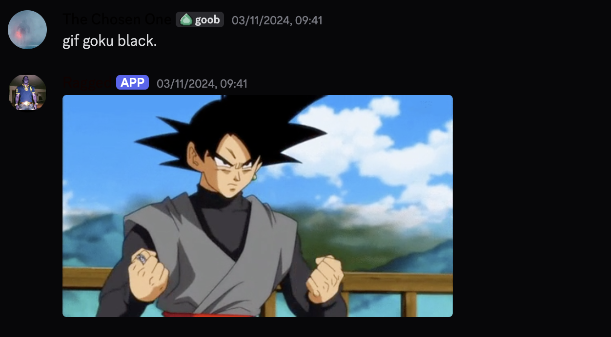
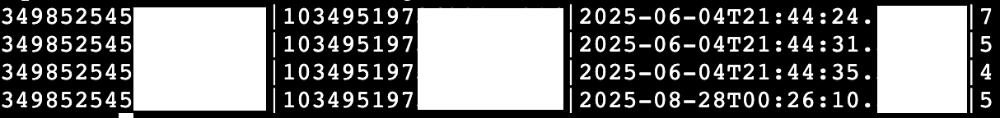

# Ragged - Your Gif-loving robot friend

Ragged is a discord bot which responds to texts in various ways. To some, it can respond with pre-determined messages such as jokes or funny quips. Additionally, it can respond to messages by query, think of it as your personal gif search engine.

Ragged runs on the AWS cloud, utilizing EC2 instances. EBS volumes are used for storage. The API keys are stored privately, using dotenv and the AWS Key Management Service.
Since Ragged is hosted in the US, there can be slight delays for users outside of the US, especially for Asia.

Ragged will also remember your messages. Be careful what you say to not get on it's wrong side.

---

## Features by Version

### V1 — Basic Message Responses
- Responds with specified messages when:
  - Messages **start with** certain character(s).
  - Messages **contain** specific words anywhere within the text.
  - Messages **start and end** with the same characters.
  

### V2 — GIF Search & Response
- Responds to messages formatted as `"gif x."` where `x` is the desired GIF search term.
- Uses the **GIPHY API** instead of Tenor for GIF searches, so results may differ from Discord's built-in GIFs.
- Always sends the **first GIF result** from the search.
- If the first result cannot be sent, Ragged replies with an error message.
- Sends the **original version** of the GIF found via GIPHY.

#### Example Use Case of Gif Query


### V3 — Cloud Deployment & 24/7 Availability
- Runs on **AWS free tier t2.micro EC2 instance**, enabling smooth, 24/7 operation.
- Uses default EBS volume for storage.
- Hosted in the **US West (us-west-1) Availability Zone**.
- Offloads compute to the cloud, minimizing local resource usage.

### V4 — Secure Private Key Management
- Private keys and sensitive credentials are securely stored **within the cloud environment**.
- This enhancement allows the repository to be **public without risking key exposure**.
- Improved security and development workflow for handling sensitive data.

### V5 — User Message Activity Logging
- Logs basic statistics for every user message. DON'T FRET! Everything being recorded is under Discord guidelines and stored offline.
  ```
  - User ID
  - Channel ID
  - Timestamp
  - Message length
  - Message content
  ```
- Stores the logged data in a local SQLite database.
- Ensures data privacy by storing logs only locally and excluding bot messages.

#### These are how messages are logged. Censored for security reasons.


---

## Notes

- This bot is open source and built to be extensible.
- Contributions and/or suggestions are welcome. :)

---

# > ⚠️ Due to pricing limitations and availability thresholds on AWS, Ragged is not currently running 24/7. However, it can be manually started anytime as needed.

